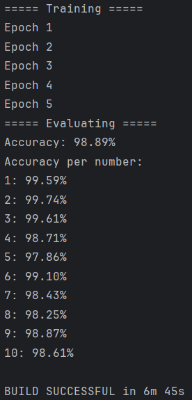

# Java: Image Classification with DeepLearning4j (DL4J)

## Запуск программы 
Для запуска программы необходимо сначала указать путь датасету MNIST (указывется абсолютный путь, как в App.java).
После программу можно запустить командой
```commandline
./gradlew run
```
Программа выполняется продолжительное время, так как происходит обучение модели CNN.

## Содержание и результаты работы
Реализована простая сверточная сеть из 5 слоев, активация была выбрана ReLu.
Алгоритм обновления параметров сети -- Adam с шагом 0.001.
Для выбора класса по итоговым вероятностям используется SoftMax.

В итоге получена точность 98.89% для тестового датасета из 10_000 изображений после обучения на 60_000 изображений с 
5 эпохами.

Результаты приведены на рисунке ниже.



Время выполнения программы для 5 эпох -- 6 минут 45 секунд, причем на одну эпоху уходит примерно минута 20 секунд,
остальное время -- инициализация и оценка модели.

Как можно увидеть точность проседает на 5, но нигде не опускается ниже 97.5%, что можно считать хорошим результатом.
Усредненная точность по всем классам: *98.89%*.
